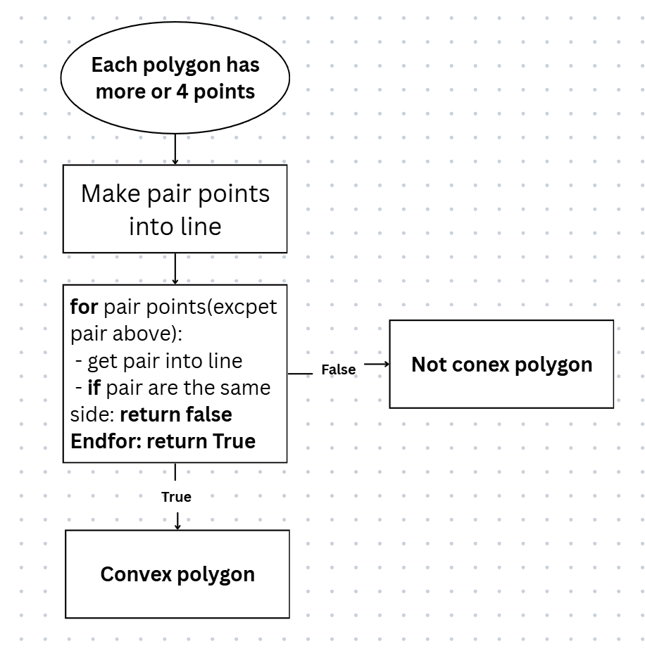
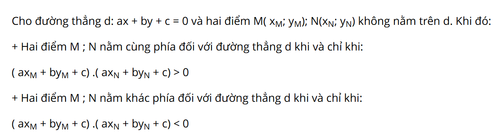

# What is a convex polygon?
**Following by Wikipedia:**
> In geometry, a convex polygon is a polygon that is the boundary of a convex set. This means that the line segment between two points of the polygon is contained in the union of the interior and the boundary of the polygon

**Can you know as**: Each pair of points, you can make a line. You don't see any point is difference side of orther points.
> **That is convex polygon**

## FlowChart
> **FlowChart**
> 

> **Mathematics for check same side:**
> 

## Visualization
I run it in visual studio.
[https://github.com/user-attachments/assets/85075d29-50ff-49ef-8512-9048dcc20a04](https://github.com/NotWorle/Check-convex-polygon/issues/4)
